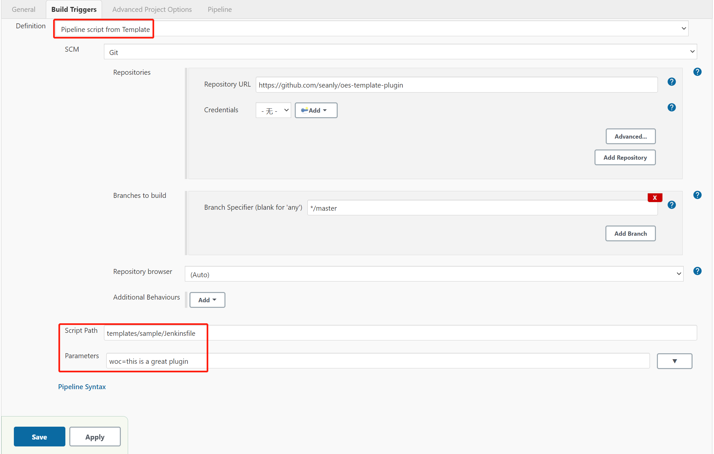

# OES Template plugin

OES Template plugin is a simple implementation of the CloudBees Pipeline Template

## Usage

First, create a [template.yaml](templates/sample/template.yaml) file that describes the meaning and type of the parameter variable

Second, write [Jenkinsfile](templates/sample/Jenkinsfile), using variables defined by template.yml

Third, create Pipeline Job and fill in configuration information with project information, such as

