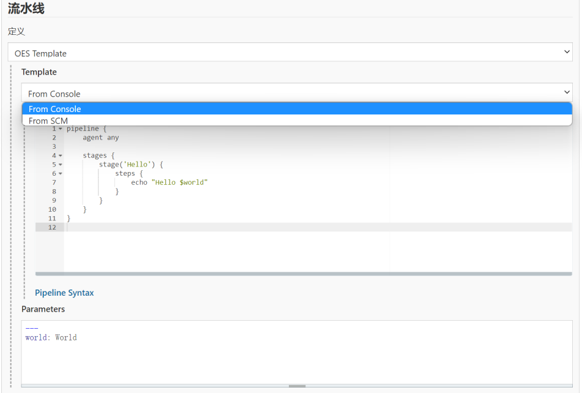
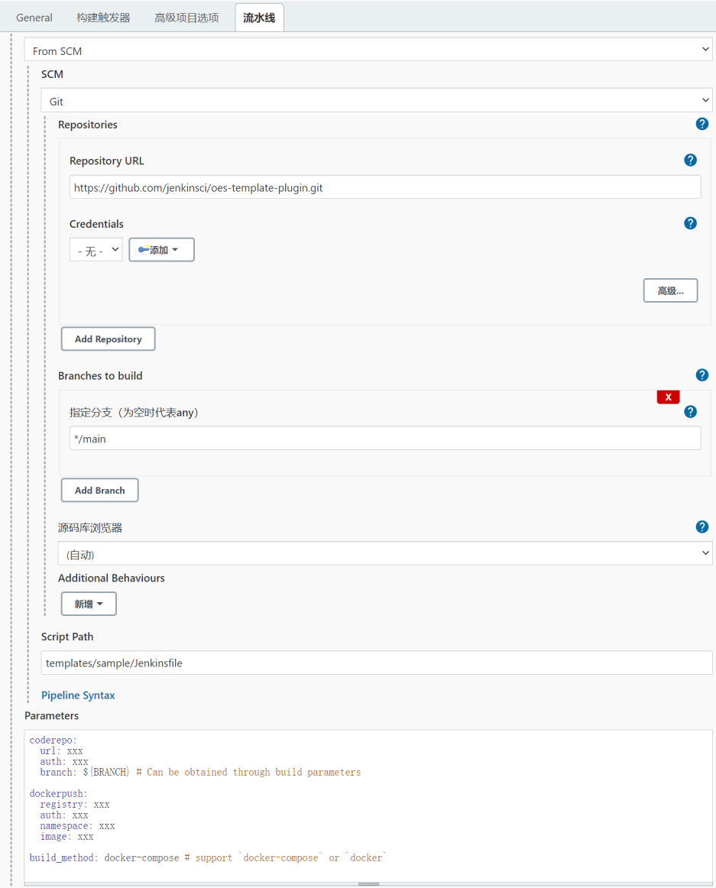

# OES Template Plugin

A simple implementation of the CloudBees Pipeline Template, But more flexible and simpler.

## A short set up guide

### Console Mode

* create `Pipeline Job` and select `From Console`, For example, the console mode here,

### SCM Mode

* create a [template.yaml](templates/sample/Template.md) file that describes the meaning and type of the parameter variable
* write [Jenkinsfile](templates/sample/Jenkinsfile), using variables defined by template.yml
* create `Pipeline Job` and select `From SCM`, For example, the SCM mode here,

**Tips**: console mode is generally used for debugging mode, and SCM mode is recommended for daily use.